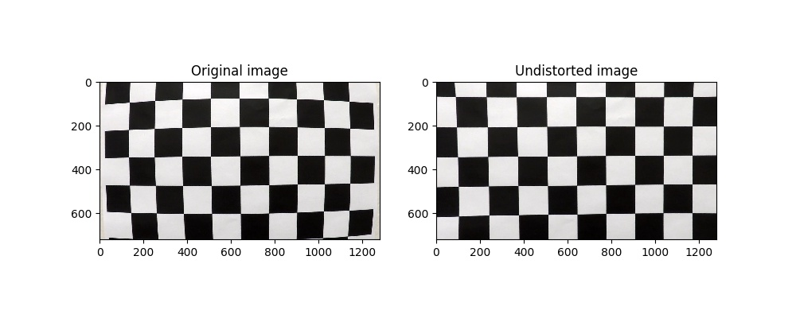
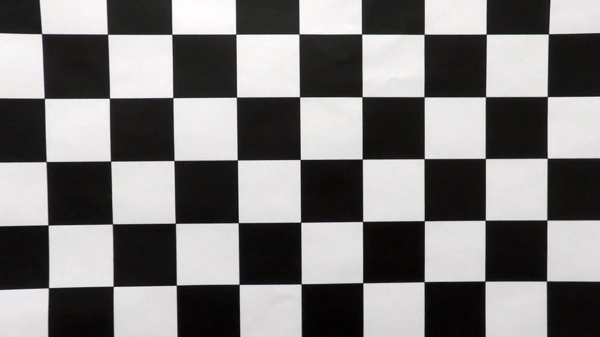
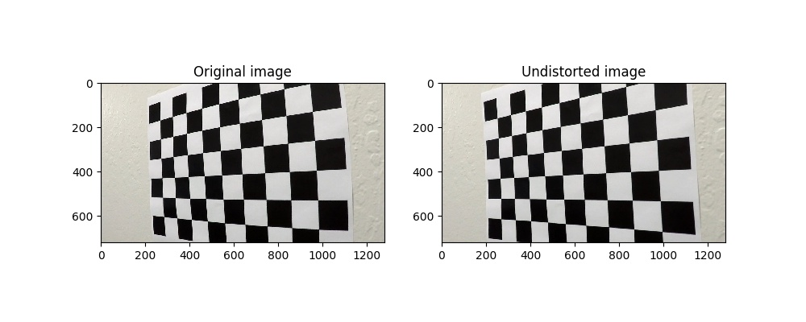
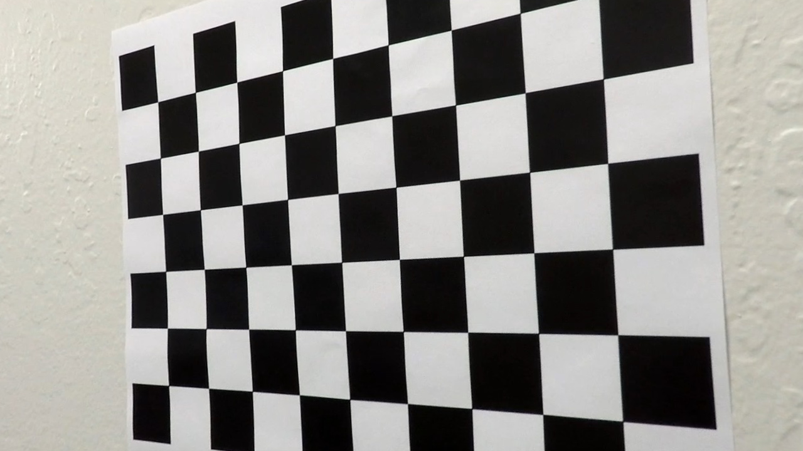
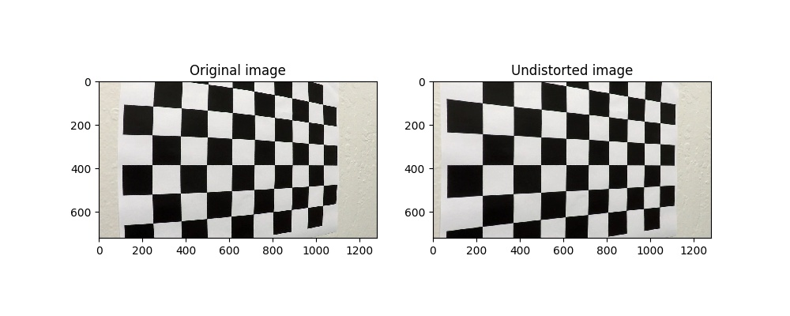
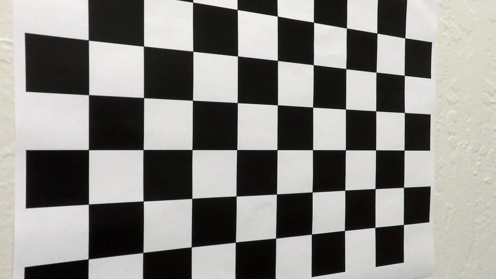

# Project 4 Advanced Lane Lines

### Remarks
* rem1
* rem2
* rem3

## 1 Camera calibration
To execute camera calibration a function was defined taking in the path of the directory containing the chessboard images as well as the number of inside corners. This function reads all rgb chessboard images, converts them to grayscale and runs opencv's 'findChessboardCorners' function returning the corners. If the 'findChessboardCorners' function does not return a positive result the image is simply added to a testset used to test the undistort results.
In total there were 3 Images not preocessed by the the 'findChessboardCorners' function.

